# Interfaz Gráfica en Java

Curso propuesto por el grupo de trabajo Semana de Ingenio y Diseño (**SID**) de la Universidad Distrital Francisco Jose de Caldas.

## Monitor

**Cristian Felipe Patiño Cáceres** - Estudiante de Ingeniería de Sistemas de la Universidad Distrital Francisco Jose de Caldas

# Clase 3

## Objetivos

- Identificar las formas de crear los objetos decoradores y como incorporarlos en nuestros objetos gráficos para dar un mejor aspecto a nuestras clases UI.
- Reconocer la importancia de los objetos decoradores y el papel que toman para que una interfaz gráfica sea mas amigable con los usuarios.

# Antes de comenzar

Recordando nuestra clase anterior habíamos creado una interfaz gráfica para un Login de usuario. Y el resultado de esa clase fue una interfaz así:

<div align="center">
  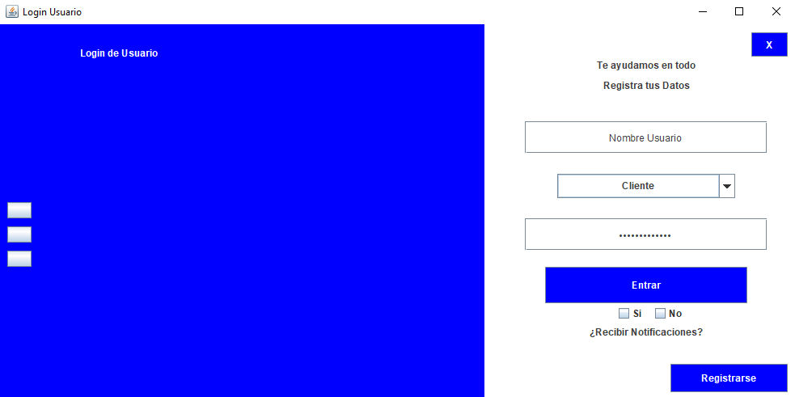
  <p>Login de usuario creada en la clase anterior</p>
</div>

En esta clase vamos a crear objetos decoradores para que nuestro login tenga un mejor aspecto.

# Etapas de creación de Objetos decoradores

Los objetos decoradores también tienen ciertas etapas en su creación, aunque estas pueden variar un poco dependiendo de los casos, sin embargo las etapas mas comunes son:

## Declaración

La declaración de un objeto decorador consiste de igual forma en indicarle al sistema que la clase donde se esta trabajando tendrá un atributo de algún tipo de estos objetos. Esta declaración tiene 3 partes, estas son:

- **Tipo Acceso:** El tipo de acceso sera siempre privado ya que son atributos de la clase como se discutió en la primera clase.
- **Tipo de Objeto Decorador:** Se refiere a la clase del objeto que vamos a crear (Color, Font, ImageIcon, Cursor son algunos ejemplos) y la generación de estas clases casi siempre van a necesitar la importación de la librería que soporte la creación del objeto, estas se hacen automáticamente dependiendo del editor.
- **Variable:** El nombre que el programador elija darle y sera esta el objeto por el cual se podrá acceder a sus métodos.

<div align="center">
  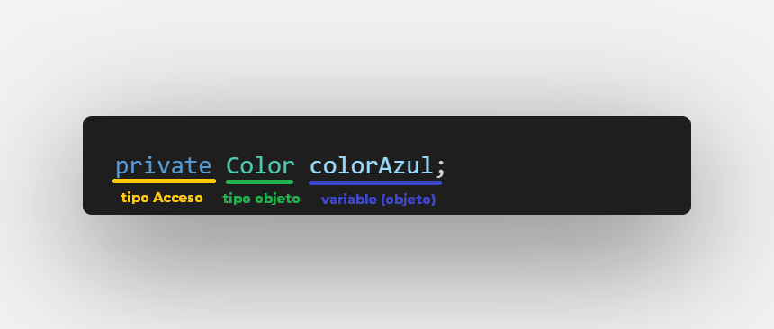
  <p>Declaración de un objeto decorador</p>
</div>

## Ejemplificación

La ejemplificación del objeto decorador consiste en darle un valor inicial al objeto y para esto es necesario llamar al constructor de la clase, **Cuando se realiza la ejemplificación al mismo tiempo se realiza la configuración del objeto**. Para este curso la ejemplificación se realizará dentro del **constructor** de nuestra clase y serán los primeros objetos solo por debajo del método **super** en caso de que exista.

<div align="center">
  
  <p>Ejemplificación de un objeto decorador</p>
</div>

## Incorporación

La incorporación se realiza cuando un objeto gráfico por medio de su configuración llama algún método relacionado con el uso de estos tipos de objetos, por eso en lugar de adicionarse mas bien se incorporan a un objeto gráfico.

<div align="center">
  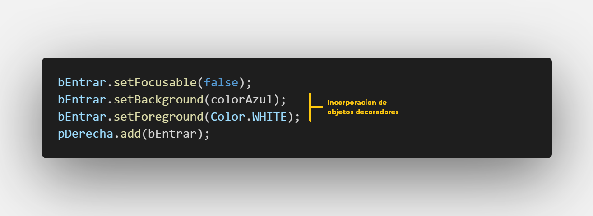
  <p>Incorporación de un objeto decorador</p>
</div>

# Creación de objetos Decoradores.

En esta sección aprenderemos la forma de crear objetos Decoradores para ser incorporados, basándonos en los 3 pasos que acabamos de ver. Los objetos explicados a continuación serán:

- **Color**
- **Font**
- **Cursor**
- **Border**
- **ImageIcon**

# Color

Los objetos decoradores de color cumplen la función de provicionarle color (Valga la redundancia) a nuestros objetos gráficos en pantalla.

Existen varias formas para crear colores en Java y a continuación mencionamos las mas importantes:

## Colores por defecto en Java

Java trae por defecto una paleta de colores y para poder ser usados solo basta con llamar la clase **Color** y al digitar . (punto) nos traerá una variedad de colores. Es importante que la librería que nos soporta la creación de los colores sea importada, esto se hace por defecto dependiendo del editor que se maneje. Cuando usamos los colores por defecto de Java **no es necesario realizar la declaración ni la ejemplificación**.

<div align="center">
  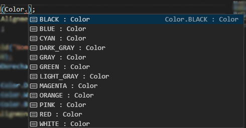
  <p>Paleta de colores por defecto de Java</p>
</div>

## Colores Personalizados

Muchas veces vamos a querer colores que Java no trae por defecto y para esto necesitamos realizar la creación de nuestro objeto decorador de tipo Color:

### Declaración

```javascript
private Color colorAzul, colorGrisOscuro;
```

La variable (objeto) que creemos para los objetos Color empezaran con color en minúscula seguido del nombre de la variable.

### Ejemplificación

```javascript
colorAzul = new Color(60, 78, 120);
colorGrisOscuro = new Color(80, 80, 80);
```

Podemos observar que la notación para la configuración de un color esta basado en la creación de colores mediante el sistema RGB proporcionando valores enteros que pueden ir desde 0 hasta 255. generarndo así la creación de una gran posibilidad de colores.

### Incorporación

```javascript
tNombreUsuario.setForeground(colorGrisOscuro);
tNombreUsuario.setBackground(Color.WHITE);
tNombreUsuario.setCaretColor(colorAzul);
```

En el anterior código se ve reflejada la incorporación de varios objetos de tipo Color para un TextField, siendo algunos de estos creados por nosotros y otros creados por defecto.

## Colores con Transparencia

Java también admite la creación de objetos rgba los cuales dan un gran uso y posibilidades para personalizar nuestra interfaz gráfica. Los pasos para la creación de ese tipo de colores es la misma que los colores personalizados que acabamos de crear. Salvo en la ejemplificación donde habrá un ligero cambio.

<div align="center">
  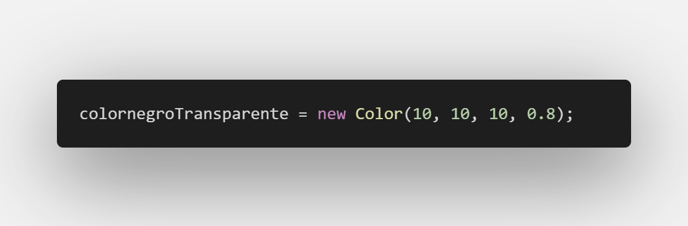
  <p>Color con transparencia</p>
</div>
El ultimo parámetro representa el alfa y es un numero flotante que va desde 0 hasta 1, siendo 1 un color solido y siendo 0 un color totalmente transparente.

## Incorporación de nuestros colores personalizados.

A continuación mostramos las partes del código donde se incorporará nuestros colores personalizados a los objetos gráficos. cabe destacar que aunque aquí se muestre desordenado, en el código estas incorporaciones se hacen en orden en la respectiva configuración de su objeto gráfico.

```javascript
lEslogan.setForeground(colorGrisOscuro);
lTituloLogin.setForeground(colorGrisOscuro);
lNotificaciones.setForeground(colorGrisOscuro);
tNombreUsuario.setForeground(colorAzul);
tNombreUsuario.setCaretColor(colorGrisOscuro);
tClaveUsuario.setForeground(colorAzul);
tClaveUsuario.setCaretColor(colorGrisOscuro);
cbTipoUsuario.setForeground(colorAzul);
bEntrar.setBackground(colorAzul);
bRegistrarse.setBackground(colorAzul);
```

Hasta el momento nuestra Interfaz Gráfica se ve asi:

<div align="center">
  
  <p>Login de usuario con incorporación de colores</p>
</div>

# Font

Los objetos Font son muy importantes para que nuestras interfaces de usuario tengan una personalización, un objeto tipo Font se encarga de proporcionar 3 elementos:

- **Tipografía:** da un nuevo aspecto a la letra de acuerdo a la tipografía seleccionada, estas fuentes que el programador puede seleccionar deben estar instaladas en la maquina previamente.
- **Estilo letra:** da un estilo a la letra de acuerdo a la configuración dada, esta podría ser **negrilla** _cursiva_ <u>subrayado</u> etc.
- **Tamaño de la fuente:** Le da el tamaño de la fuente dependiendo del numero entero que reciba.

A continuación crearemos nuestros objetos Font:

## Declaración

```javascript
private Font fontTPrincipal, fontTitulo, fontSubtitulo;
```

La variable (objeto) que creemos para los objetos Font empezaran con font en minúscula seguido del nombre de la variable.

## Ejemplificación

```javascript
fontTPrincipal = new Font("Rockwell Extra Bold", Font.PLAIN, 20);
fontTitulo = new Font("Montserrat", Font.PLAIN, 18);
fontSubtitulo = new Font("Forte", Font.PLAIN, 13);
```

Podemos observar que al momento de ejemplificar el objeto se realiza su respectiva configuración desde el constructor pasando 3 parámetros que ya mencionamos con anterioridad.

- La fuente dada debe estar en comillas.
- Los diferentes estilos se pueden observar llamando a la clase Font y poniendo un . (punto).
- El tamaño de la letra sera un numero entero.
<div align="center">
  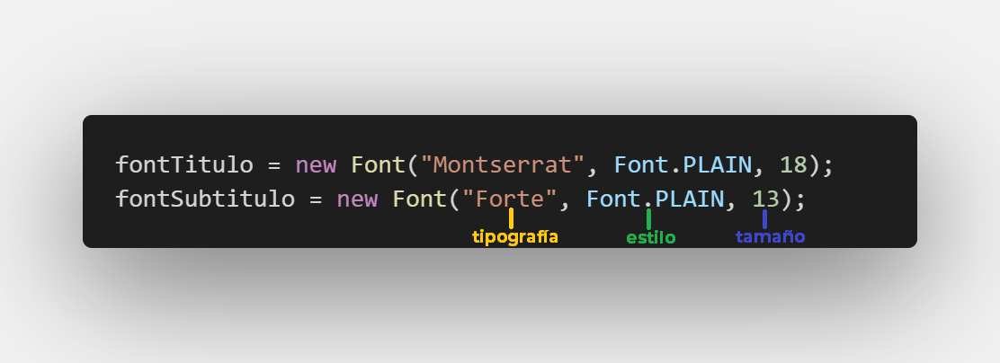
  <p>Ejemplo de ejemplificación de objetos decoradores tipo Font</p>
</div>

## Incorporación

A continuación mostramos las partes del código donde incorporamos nuestros objetos decoradores Font. Recordar que aquí se muestra desordenado, sin embargo en el código estas incorporaciones se hacen en orden en la respectiva configuración de su objeto gráfico.

```javascript
lTituloApp.setBounds(100, 20, 220, 30);
lTituloApp.setFont(fontTPrincipal);
lEslogan.setFont(fontSubtitulo);
lTituloLogin.setSize(150, 30);
lTituloLogin.setFont(fontTitulo);
lNotificaciones.setFont(fontSubtitulo);
```

Se puede observar que para realizar la incorporación de las fuentes se debe llamar el método:

- **setFont** que recibe por parámetro un objeto decorador tipo Font y refleja un estilo en la letra del objeto gráfico.

También se puede observar que se realizaron unos cambios en el tamaño de algunos label para que no hubiera conflictos cuando se incorporen las fuentes.

Nuestra aplicación luce asi:

<div align="center">
  
  <p>Login de usuario con incorporación de fuentes</p>
</div>

# Cursor

Los cursores son todas las formas que pueden tomar nuestro puntero del Mouse mientras pasa por alguna zona de nuestra ventana, por ejemplo es común ver un icono de una mano cuando se pasa por un botón, una cruz cuando se esta trabajando en un espacio de dibujos (Paint por dar un ejemplo) un icono de bloqueo cuando no se pueda dar click en una parte etc.

### Declaración

```javascript
private Cursor cMano;
```

La variable (objeto) que creemos para los objetos Cursor empezaran con c en minúscula seguido del nombre de la variable.

### Ejemplificación

```javascript
cMano = new Cursor(Cursor.HAND_CURSOR);
```

Java proporciona una totalidad de 15 opciones de cursores para incorporar en nuestras Interfaces de usurario, a continuación se muestran algunos de los mas importantes.

| Cursor           | Descripción                                       | imagen                        |
| ---------------- | ------------------------------------------------- | ----------------------------- |
| CROSSHAIR_CURSOR | Cursor en forma de Cruz                           |    |
| DEFAULT_CURSOR   | Puntero en forma de flecha que esta por defecto   |  |
| E_RESIZE_CURSOR  | Cursor con dos flechas unidas de forma horizontal |  |
| N_RESIZE_CURSOR  | Cursor con dos flechas unidas de forma Vertical   | 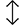 |
| HAND_CURSOR      | Cursor con una mano                               |     |
| MOVE_CURSOR      | Cursor en forma de Cruz con punta de flechas      |     |
| TEXT_CURSOR      | Cursor en forma de linea para texto               |     |
| WAIT_CURSOR      | Cursor en forma circular para esperar             |     |

### Incorporación

A continuación mostramos las partes del código donde incorporamos nuestros objetos decoradores Cursor. Recordar que aquí se muestra desordenado, sin embargo en el código estas incorporaciones se hacen en orden en la respectiva configuración de su objeto gráfico.

```javascript
bEntrar.setCursor(cMano);
bCerrar.setCursor(cMano);
bRegistrarse.setCursor(cMano);
bOpcion1.setCursor(cMano);
bOpcion2.setCursor(cMano);
bOpcion3.setCursor(cMano);
checkSi.setCursor(cMano);
checkNo.setCursor(cMano);
```

Se puede observar que el método para incorporar este objeto decorador es:

- **setCursor:** recibe por parámetro un objeto de tipo Cursor y se ve reflejado cuando el usuario pasa por encima del objeto gráfico con el Mouse cambiando el icono del puntero.

Ahora nuestra interfaz gráfica tiene interactividad con el Mouse cada que el usuario pasa por nuestros botones:

<div align="center">
  
  <p>Login de usuario con incorporación de Cursores</p>
</div>

# Borders

Los borders son aquellos que resaltan los limites de espacio de nuestros objetos gráficos y existen una gran variedad de bordes para poner en nuestros componentes gráficos.
A continuación mostraremos los bordes mas importantes y cabe resaltar que la declaración e incorporación son muy similares por lo que nos concentraremos en mostrar los diferentes bordes en la ejemplificación.

## Declaración

```javascript
private Border border;
```

La variable (objeto) que creemos para los objetos Border empezaran con border en minúscula seguido del nombre de la variable. En este caso solo usaremos un borde por lo que solo usaremos la palabra clave.

## Ejemplificación

A continuación mostraremos los diferentes bordes que pueden crearse usando nuestro único objeto (border) para mostrar la variedad de estos, sin embargo en nuestro login usaremos solo un tipo de estos bordes.

### **BorderFactory**

Antes de mostrar los diferentes bordes debemos implementar la librería **borderFactory** de Swing que nos dará la posibilidad de crear nuestros borders.

```javascript
import javax.swing.BorderFactory;
```

### **LineBorder**

Dibuja en los limites del objeto gráfico un borde con una linea:

```javascript
border = BorderFactory.createLineBorder(colorAzul, 2, true);
```

Podemos observar que para crear el borde tenemos que llamar primero a la clase **BorderFactory** y seleccionamos la opción **createLineBorder**.
Los parámetros que recibe son:

- **Color de linea:** recibe un objeto decorador tipo Color y representa el color de la linea.
- **Grosor:** recibe un numero entero que representa el grosor de la linea.
- **Bordes redondos:** recibe un booleano para indicar si quiere que las esquinas del borde estén redondeadas o no. Así pongamos True el cambio sera muy mínimo, no te preocupes si no notas el cambio.

#### Ejemplo

<div align="center">
  
  <p>LineBorder en un JTextField</p>
</div>

### **LoweredBevelBorder**

Dibuja un borde basado en sombras para crear un efecto en el cual el objeto gráfico pareciera estar hundido con respecto a la ventana. Este efecto se consigue dibujando las sombras en la parte superior y parte izquierda del objeto gráfico. Existen dos variaciones **LoweredBevelBorder** o **LoweredSoftBevelBorder**, según la propia Documentación de Java la variación con el **Soft** genera sombras mas suaves en las esquinas sin embargo es difícil notar la diferencia.

Una desventaja de este tipo de bordes es que solo se notara cuando la ventana o panel donde esta el objeto gráfico tiene el color por defecto (gris) de lo contrario solo se vera con dos lineas en la parte izquierda y superior.

```javascript
border = BorderFactory.createLoweredBevelBorder();
```

Podemos observar que para crear el borde tenemos que llamar primero a la clase **BorderFactory** y seleccionamos la opción **createLoweredBevelBorder**.

#### Ejemplo

<div align="center">
  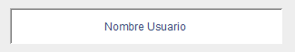
  <p>LoweredBevelBorder en un JTextField</p>
</div>

### **RaisedBevelBorder**

Dibuja un borde basado en sombras para crear un efecto en el cual el objeto gráfico pareciera estar encima con respecto a la ventana. Este efecto se consigue dibujando las sombras en la parte inferior y parte derecha del objeto gráfico. Existen dos variaciones **RaisedBevelBorder** o **RaisedSoftBevelBorder**, según la propia Documentación de Java la variación con el **Soft** genera sombras mas suaves en las esquinas sin embargo es difícil notar la diferencia.

De nuevo la desventaja de este tipo de bordes es que solo se notara cuando la ventana o panel donde esta el objeto gráfico tiene el color por defecto (gris) de lo contrario solo se vera con dos lineas en la parte derecha e inferior.

```javascript
border = BorderFactory.createRaisedBevelBorder();
```

Podemos observar que para crear el borde tenemos que llamar primero a la clase **BorderFactory** y seleccionamos la opción **createRaisedBevelBorder**.

#### Ejemplo

<div align="center">
  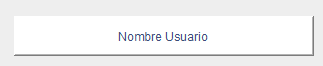
  <p>RaisedBevelBorder en un JTextField</p>
</div>

### **BevelBorder**

Una buena solución al las desventajas de los bordes anteriores puede ser este borde que en realidad es una combinación y mejora de los dos anteriores, este borde recibe colores en su constructor lo que hace que podamos usarlos sobre cualquier color de fondo. Entonces un BevelBorder se caracteriza por dibujar 4 lineas:

- **Linea Externa Lower:** dibuja una linea en la parte superior y en la parte izquierda del objeto y estará en el la parte externa.
- **Linea Interna Lower:** dibuja una linea en la parte superior y en la parte izquierda del objeto y estará en el la parte interna.
- **Linea Externa Raise:** dibuja una linea en la parte inferior y en la parte derecha del objeto y estará en el la parte externa.
- **Linea Interna Raise:** dibuja una linea en la parte inferior y en la parte derecha del objeto y estará en el la parte interna.

De igual manera este tiene dos variaciones **BevelBorder** y **SoftBevelBorder** que como comentamos da un suavizado en las esquinas pero el cambio no es muy notorio.

```javascript
border = BorderFactory.createBevelBorder(
  BevelBorder.RAISED,
  Color.LIGHT_GRAY,
  colorGrisOscuro,
  Color.LIGHT_GRAY,
  Color.WHITE
);
```

Podemos observar que para crear el borde tenemos que llamar primero a la clase **BorderFactory** y seleccionamos la opción **createBevelBorder**.
Este recibe por parámetros:

- **Tipo borde Bevel:** recibe un tipo de borde tipo Bevel (Lower o Raised) y en realidad lo que hace esta configuración es cambiar el orden de los colores que va a recibir por parámetro dependiendo de la elección.
- **Color Externo1:** Recibe un objeto decorador tipo Color y representa el color externo ya sea del Lower o el Raise
- **Color Interno1:** Recibe un objeto decorador tipo Color y representa el color interno que acompaña al color externo 1 ya sea del Lower o el Raise
- **Color Externo2:** Recibe un objeto decorador tipo Color y representa el color externo del contrario a la opción escogida.
- **Color Interno2:** Recibe un objeto decorador tipo Color y representa el color interno que acompaña al color externo 2.

Cabe destacar que con este borde podemos buscar el efecto de **Hundido** o **Encima** o también buscar otros efectos con la combinación de varios colores.

#### Ejemplo

<div align="center">
  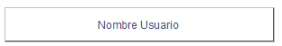
  <p>BevelBorder en un JTextField</p>
</div>

<div align="center">
  
  <p>BevelBorder en un JTextField con colores</p>
</div>

### **EtchedBorder**

Este tipo de borde dibuja 2 LineBorder en el objeto gráfico dejando así una linea interna y una linea externa. Este tipo de bordes da un buen efecto de difuminado pequeño o de iluminado si se usan los colores correctos.

```javascript
border = BorderFactory.createEtchedBorder(EtchedBorder.RAISED, Color.ORANGE, Color.YELLOW);
```

Podemos observar que para crear el borde tenemos que llamar primero a la clase **BorderFactory** y seleccionamos la opción **createEtchedBorder**.
Este recibe por parámetros:

- **Tipo borde Etched:** recibe un tipo de borde tipo Etched (Lower, Raised) y en realidad lo que hace esta configuración es cambiar el orden de los colores que va a recibir por parámetro dependiendo de la elección.
- **Color Externo:** Recibe un objeto decorador tipo Color y representa el color externo.
- **Color Interno:** Recibe un objeto decorador tipo Color y representa el color interno.

#### Ejemplo

<div align="center">
  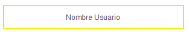
  <p>EtchedBorder en un JTextField</p>
</div>

### **MatteBorder**

Este es uno de los bordes más usados y aunque su configuración es simple se puede sacar gran provecho de este. Dibuja una linea en los lados que nosotros queramos, por ejemplo para un panel en la parte izquierda seria bueno un borde en la parte derecha nada mas indicando la separación y con este tipo de Border se puede lograr.

```javascript
border = BorderFactory.createMatteBorder(0, 0, 3, 0, colorAzul);
```

Podemos observar que para crear el borde tenemos que llamar primero a la clase **BorderFactory** y seleccionamos la opción **createMatteBorder**.
Este recibe por parámetros:

- **grosor en la linea superior:** recibe un numero entero que indica el grosor en la linea superior.
- **grosor en la linea izquierda:** recibe un numero entero que indica el grosor en la linea izquierda.
- **grosor en la linea inferior:** recibe un numero entero que indica el grosor en la linea inferior.
- **grosor en la linea derecha:** recibe un numero entero que indica el grosor en la linea derecha.
- **Color del borde:** recibe un objeto decorador tipo Color y representa el color del borde.

#### Ejemplo

<div align="center">
  
  <p>MatteBorder en un JTextField</p>
</div>

### **DashedBorder**

Dibuja un tipo de borde con una linea punteada o intermitente para limitar el objeto gráfico.

```javascript
border = BorderFactory.createDashedBorder(colorAzul, 2, 3, 2, true);
```

Podemos observar que para crear el borde tenemos que llamar primero a la clase **BorderFactory** y seleccionamos la opción **createDashedBorder**.
Este recibe por parámetros:

- **Color del borde:** recibe un objeto decorador tipo Color y representa el color del borde.
- **grosor de la linea:** recibe un numero entero que indica el grosor de la linea.
- **largo de las lineas:** recibe un numero entero que indica el largo de cada una de las lineas intermitentes.
- **Espacio entre lineas:** recibe un numero entero que indica el espacio que hay entre las lineas.
- **bordes redondiados:** recibe un booleano que si se deja como True pondrá los bordes redondeados.

#### Ejemplo

<div align="center">
  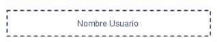
  <p>DashedBorder en un JTextField</p>
</div>

### **CompoundBorder**

Es un Border compuesto que recibe como parámetro dos objetos Borders y los combina, dejando uno como borde interno y el otro como borde externo.

A continuación veremos una implementación de este borde con la combinación de varios LineBorders para dar un efecto difuminado.

<div align="center">
  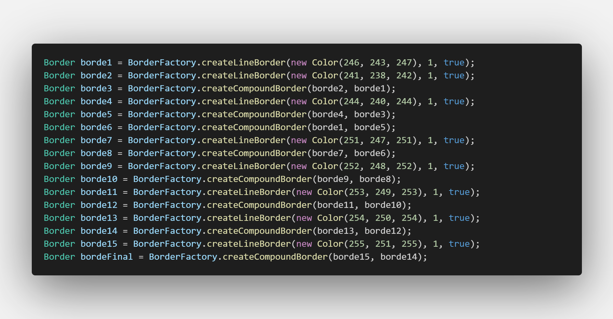
  <p>Implementación de CompoundBorder</p>
</div>

Podemos observar que para crear el borde tenemos que llamar primero a la clase **BorderFactory** y seleccionamos la opción **createCompoundBorder**.
Este recibe por parámetros:

- **borde Interno:** recibe un objeto tipo Border y representa el borde interno.
- **borde Externo:** recibe un objeto tipo Border y representa el borde Externo.

#### Resultado

<div align="center">
  
  <p>Ejemplo de un CompoundBorder en un JPanel</p>
</div>

## Incorporación

A continuación mostramos el borde que usaremos para nuestra ventana y las incorporaciones de este en nuestro código. También mostraremos algunas correcciones de nuestros objetos gráficos para que tengan un mejor aspecto con la incorporación de nuestro borde. Recordar que aquí se muestra desordenado, sin embargo en el código estas incorporaciones se hacen en orden en la respectiva configuración de su objeto gráfico.

```javascript
border = BorderFactory.createMatteBorder(0, 0, 2, 0, colorAzul);
```

```javascript
tNombreUsuario.setSize(260, 40);
tNombreUsuario.setBorder(border);
tClaveUsuario.setSize(260, 40);
tClaveUsuario.setBorder(border);
cbTipoUsuario.setLocation((pDerecha.getWidth() - cbTipoUsuario.getWidth()) / 2, 195);
```

Hasta el momento nuestra interfaz estará así:

<div align="center">
  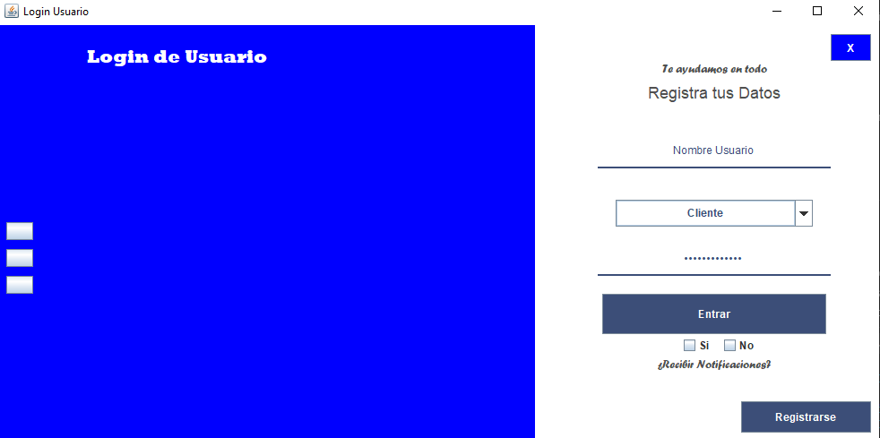
  <p>Login de usuario con la incorporación de bordes</p>
</div>

# ImagenIcon

Las imágenes en nuestras ventanas son quizás el objeto decorador determinante para que nuestras interfaces gráficas luzcan mucho mas amigable con nuestros usuarios. A continuación veremos la creación de estos objetos decoradores y la incorporación en nuestra interfaz de Login para resaltar su importancia.

## Antes de comenzar

Es importante tener todos nuestros recursos dentro de un paquete en nuestro proyecto. Para esto crearemos una carpeta llamada **resources** que estará en la raíz de nuestro proyecto junto a la carpeta **src**
y adentro creamos una carpeta llamada **img** allí es donde guardaremos nuestras imágenes.

<div align="center">
  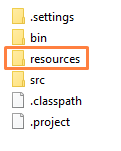
  <p>Carpeta resources dentro del proyecto</p>
</div>

<div align="center">
  
  <p>Carpeta img dentro de la carpeta resources</p>
</div>

<div align="center">
  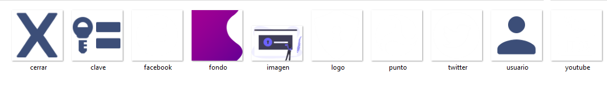
  <p>imágenes que vamos a usar en nuestra interfaz</p>
</div>

**Nota**

Estas imágenes puedes descargarlas desde este mismo repositorio, entrando a la carpeta **Clase3** seguido de la carpeta a **resources/img** y ahi podrás ver y descargar cada una de las imágenes.

<div align="center">
  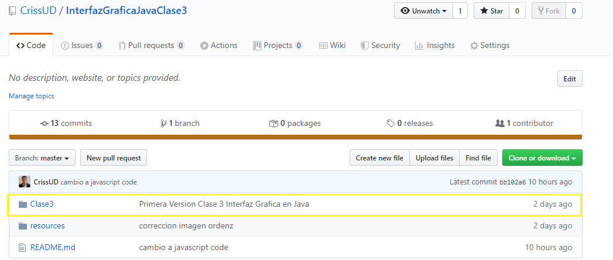
  <p>Carpeta clase3 dentro del repositorio</p>
</div>

<div align="center">
  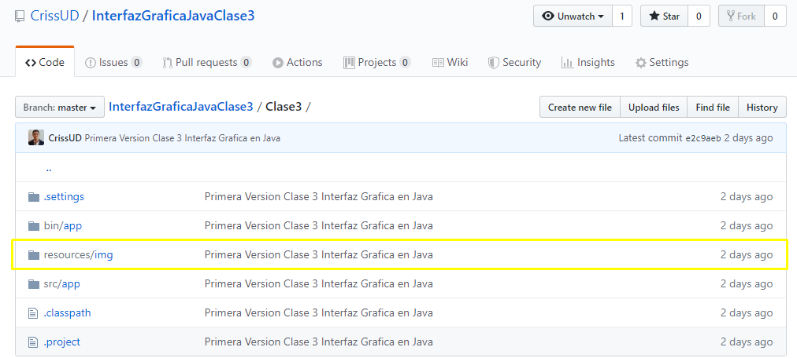
  <p>Carpeta resources/img dentro del repositorio</p>
</div>

<div align="center">
  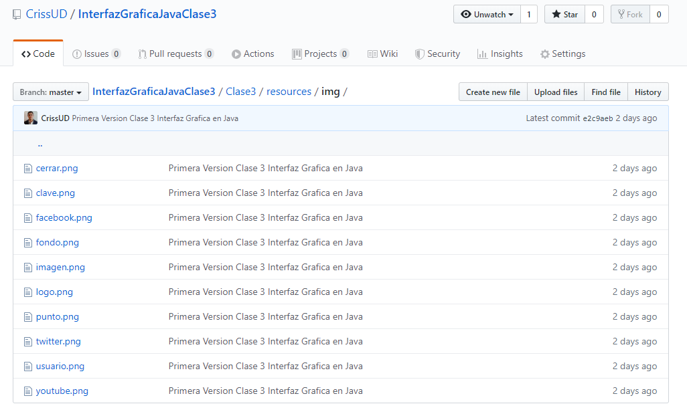
  <p>Lista de imágenes dentro del repositorio</p>
</div>

<div align="center">
  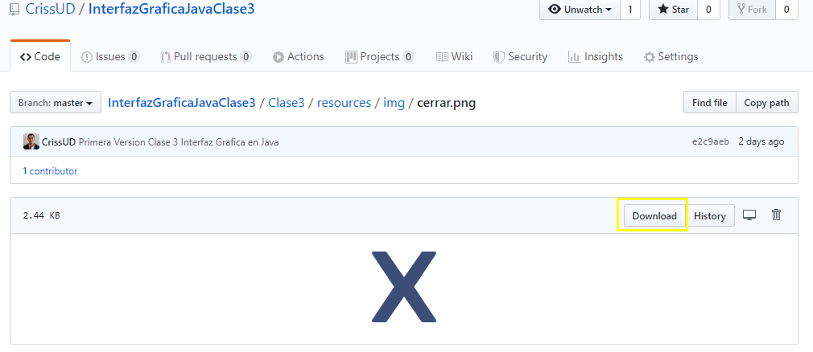
  <p>Descarga de imágenes dentro del repositorio</p>
</div>

## Declaración

```javascript
private ImageIcon iFondo, iSvg, iLogo, iUsuario, iClave, iPunto, iFacebook, iTwitter, iYoutube, iCerrar, iDimAux;
```

La variable (objeto) que creemos para los objetos ImageIcon empezaran con i en minúscula seguido del nombre de la variable.

## Ejemplificación

A continuación mostramos la ejemplificación y configuración de nuestros objetos Decoradores tipo ImageIcon:

```javascript
iFondo = new ImageIcon("Clase3/resources/img/fondo.png");
iLogo = new ImageIcon("Clase3/resources/img/logo.png");
iUsuario = new ImageIcon("Clase3/resources/img/usuario.png");
iClave = new ImageIcon("Clase3/resources/img/clave.png");
iPunto = new ImageIcon("Clase3/resources/img/punto.png");
iFacebook = new ImageIcon("Clase3/resources/img/facebook.png");
iTwitter = new ImageIcon("Clase3/resources/img/twitter.png");
iYoutube = new ImageIcon("Clase3/resources/img/youtube.png");
iSvg = new ImageIcon("Clase3/resources/img/imagen.png");
iCerrar = new ImageIcon("Clase3/resources/img/cerrar.png");
```

Se puede observar que al momento de ejemplificar el objeto decorador ImageIcon, este recibe por parámetro un String que en realidad representa
la dirección donde esta contenida la imagen. También es importante fijarse en la extensión de la imágen en este ejemplo todas son **.png** pero Java también soporta **.jpg**, **.gif** etc.

**Una cosa importante que hay que resaltar es que la dirección puede variar entre editores de código, por ejemplo estas direcciónes funcionan en el editor de texto Visual Studio Code. Pero en NetBeans por ejemplo habría que quitar en la dirección la parte "Clase3/" y empezar por "resources/.."**

## Incorporación

Muchas veces queremos incorporar nuestras imágenes a nuestra ventana y no necesariamente incorporarlas a un botón, un JTextField etc. Una manera de realizar esto es mediante la creación de labels que contengan estas imágenes. Ya que los JLabel por defecto traen un fondo transparente y esto sera de gran utilidad. Por lo que vamos a crear nuestros JLabel correspondientes:

## Declaración objetos JLabel

```javascript
private JLabel lFondo, lSvg, lLogo, lUsuario, lClave, lFacebook, lTwitter, lYoutube;
```

## Ejemplificación y Configuración y Adición objetos JLabel

Vamos a ver el ejemplo con uno de ellos por ahora para explicar unos **aspectos importantes**.

Vamos a añadir un fondo a nuestra interfaz, lo primero que haremos es poner el color de fondo de nuestro pIzquierda a blanco:

```javascript
pIzquierda.setBackground(Color.white);
```

Asi quedaría nuestra interfaz:

<div align="center">
  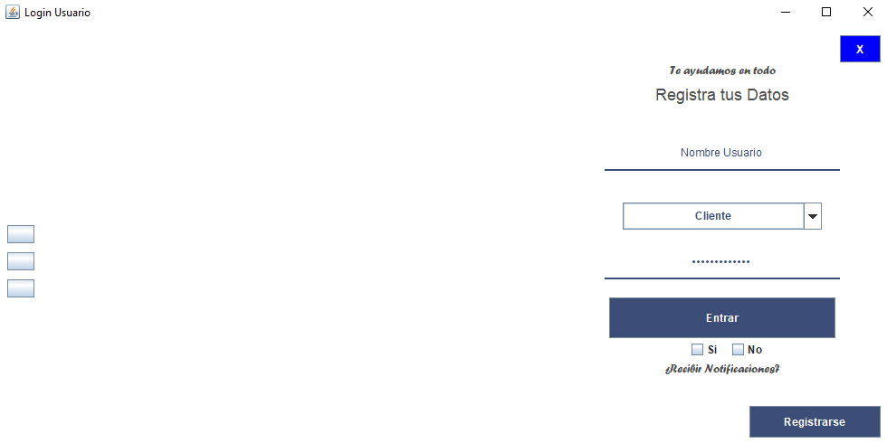
  <p>Login de usuario cambiando el color de fondo al pIzquierda</p>
</div>

Ahora vamos a Ejemplificar y configurar nuestro objeto JLabel.

Quizás te estes preguntando en este momento:
**¿si quiero una imagen de fondo, por que no incorporarla al JPanel de una vez?**

Esto es debido a que los JPanel no tienen la propiedad de incorporar una imagen. Por eso lo haremos por medio de un JLabel.

```javascript
lFondo = new JLabel();
lFondo.setBounds(0, 0, 600, 600);
lFondo.setIcon(iFondo);
pIzquierda.add(lFondo);
```

Se puede observar que el método para incorporar un objeto decorador tipo ImageIcon es:

- **setIcon:** que recibe por parámetro un objeto decorador ImageIcon y representa la imagen que se añade a nuestra ventana.

### **Aspecto 1 Orden de objetos mostrados en pantalla**

Una pregunta realmente importante que hay que hacerse es **¿en que parte del constructor coloco la creación de mi nuevo objeto gráfico?** Y esta pregunta es valida por que si por ejemplo ponemos este fragmento de código justo después de la creación de los JPanel ocurre lo siguiente:

<div align="center">
  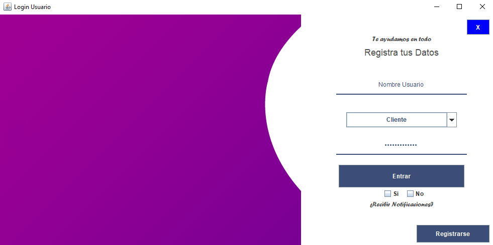
  <p>Login de usuario agregando imagen de fondo justo después de la creación de los paneles</p>
</div>

Se puede observar que la imagen de fondo quedo encima del Label que daba el titulo y encima de los botones que habíamos puesto ahí. Y es por que Java **pondrá los elementos uno detrás de otro en el eje Z a medida que se vayan añadiendo.** Por lo que si queremos que nuestra imagen quede en el fondo tendremos que ponerla de ultimas justo después de los últimos botones que habíamos adicionado en el panel pIzquierda:

<div align="center">
  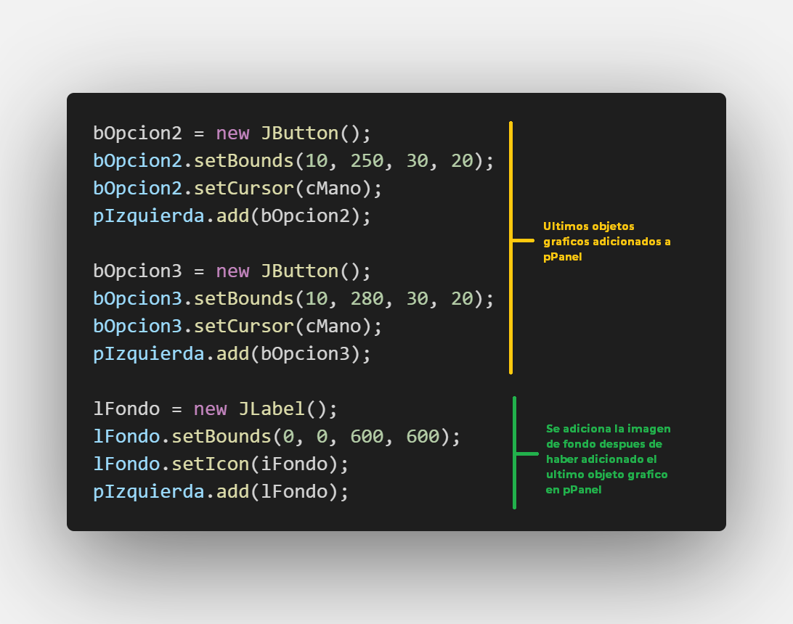
  <p>Orden en código de elementos en pIzquierda para que la imagen quede en el fondo de nuestra ventana</p>
</div>

De esta manera nuestra interfaz quedara asi:

<div align="center">
  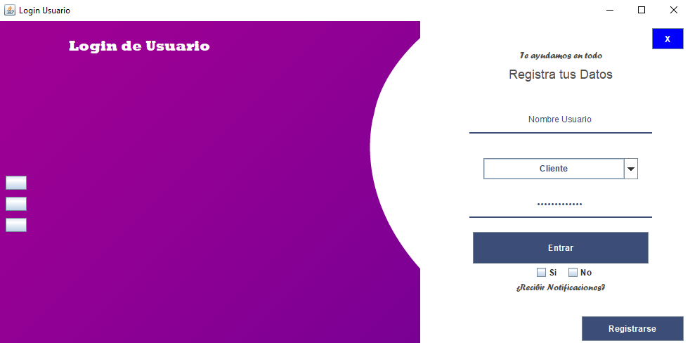
  <p>Login de usuario agregando imagen de fondo justo después de la creación del ultimo objeto gráfico adicionado en pIzquierda</p>
</div>

### **Aspecto 2: Redimensión de nuestras imágenes**

Se pueden dar cuenta que en nuestra interfaz la imagen de fondo quedo incorporada sin embargo no quedo como esperábamos. Esto es debido a que nuestra imagen es de dimensiones mucho mas grandes que las de nuestra ventana asi que será buena idea redimensionarla.

Una posible forma seria redimensionar nuestra imagen de forma manual con algún programa como photoshop, sin embargo, esto no es nada optimo y menos si hay miles de imágenes por redimensionar.

La mejor forma es haciendolo en nuestro código y para esto necesitamos de un objeto auxiliar:

<div align="center">
  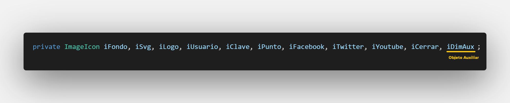
  <p>Objeto Auxiliar</p>
</div>

Antes de poder realizar nuestra redimension necesitamos agregar una librería mas a nuestro código:

```javascript
import java.awt.Image;
```

Para realizar esta redimension realizaremos este código justo encima de nuestra creación de nuestro JLabel que contiene la imagen de fondo:

```javascript
iDimAux = new ImageIcon(iFondo.getImage().getScaledInstance(600, 600, Image.SCALE_AREA_AVERAGING));

lFondo = new JLabel();
...
```

se puede observar que se esta realizando una ejemplificación de un objeto decorador ImageIcon, sin embargo no está recibiendo ninguna ruta, este esta recibiendo por parámetro otro objeto ImageIcon y se están llamando el siguiente método:

- **getImage:** que nos trae el Objeto **Image** de nuestro ImageIcon, esto se realiza para poder obtener las propiedades del objeto tipo **Image** como la **redimension** ya que el objeto ImageIcon no cuenta con esta propiedad dentro de su configuración.

Una vez con nuestro objeto **Image** procedemos a llamar su método:

- **getScaledInstance:** que se encarga de redimensionar nuestra imagen al tamaño que le demos y recibe estos parámetros:
  - **ancho:** Un numero entero que representa el nuevo ancho de la imagen
  - **alto:** Un numero entero que representa el nuevo alto de la imagen
  - **sistema de escala:** Es un sistema interno de la clase **Image** que se encarga de re acomodar los pixeles. Existen varias opciones para escalar los pixes (**SCALE_AREA_AVERAGING, SCALE_DEFAULT, SCALE_REPLICATE** etc). sin embargo el que por experiencia me da mejores resultados es el **SCALE_AREA_AVERAGING**

Si ejecutamos nuestra aplicación podremos darnos cuenta que la imagen sigue igual **¿por qué?**, ya que nos falto cambiar el ImageIcon en nuestro label, ahora este debe incorporar el ImageIcon **iDimAux**

```javascript
lFondo.setIcon(iDimAux);
```

Y ahora nuestra interfaz se vera asi:

<div align="center">
  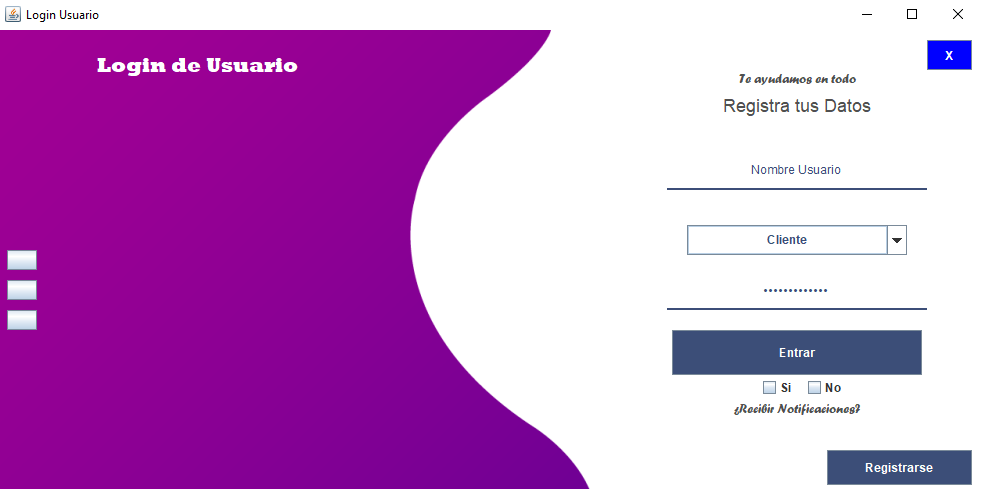
  <p>Login de usuario con imagen de fondo redimensionada</p>
</div>

## Creando nuestros otros label para mostrar en nuestra Interfaz

A continuación vamos a mostrar la creación de los objetos JLabel que incorporan nuestras imágenes repitiendo el proceso que vimos anteriormente. Recordar que aunque se muestre el código aquí en desorden en la aplicación se ponen en el orden de tal manera que tenemos presente la organización de objetos con respecto al eje Z.

```javascript
iDimAux = new ImageIcon(iLogo.getImage().getScaledInstance(40, 40, Image.SCALE_AREA_AVERAGING));

lLogo = new JLabel();
lLogo.setBounds(50, 20, 40, 40);
lLogo.setIcon(iDimAux);
pIzquierda.add(lLogo);
```

```javascript
iDimAux = new ImageIcon(iSvg.getImage().getScaledInstance(500, 345, Image.SCALE_AREA_AVERAGING));

lSvg = new JLabel();
lSvg.setBounds(100, 100, 500, 345);
lSvg.setIcon(iDimAux);
pIzquierda.add(lSvg);
```

```javascript
iDimAux = new ImageIcon(iFacebook.getImage().getScaledInstance(30, 30, Image.SCALE_AREA_AVERAGING));

lFacebook = new JLabel();
lFacebook.setBounds(20, 420, 30, 30);
lFacebook.setIcon(iDimAux);
pIzquierda.add(lFacebook);

iDimAux = new ImageIcon(iTwitter.getImage().getScaledInstance(30, 30, Image.SCALE_AREA_AVERAGING));

lTwitter = new JLabel();
lTwitter.setBounds(60, 420, 30, 30);
lTwitter.setIcon(iDimAux);
pIzquierda.add(lTwitter);

iDimAux = new ImageIcon(iYoutube.getImage().getScaledInstance(30, 30, Image.SCALE_AREA_AVERAGING));

lYoutube = new JLabel();
lYoutube.setBounds(100, 420, 30, 30);
lYoutube.setIcon(iDimAux);
pIzquierda.add(lYoutube);
```

```javascript
iDimAux = new ImageIcon(iUsuario.getImage().getScaledInstance(30, 30, Image.SCALE_AREA_AVERAGING));

lUsuario = new JLabel();
lUsuario.setBounds(40, 130, 30, 30);
lUsuario.setIcon(iDimAux);
pDerecha.add(lUsuario);

iDimAux = new ImageIcon(iClave.getImage().getScaledInstance(30, 30, Image.SCALE_AREA_AVERAGING));

lClave = new JLabel();
lClave.setBounds(40, 250, 30, 30);
lClave.setIcon(iDimAux);
pDerecha.add(lClave);
```

Con estas adiciones en nuestro código la interfaz gráfica queda asi:

<div align="center">
  
  <p>Login de usuario con incorporación de ImageIcon</p>
</div>

!Ya falta poco! Ahora tenemos dos imágenes que no hemos incorporado aun, estas se van a incorporar en nuestros botones, bCerrar y bOpcion1, bOpcion2, bOpcion3.

Vamos a empezar por nuestros botones opciones, la imagen que queremos incorporar es iPunto.

para esto vamos a redimensionar nuestra imagen e incorporarla en nuestros botones:

```javascript
iDimAux = new ImageIcon(iPunto.getImage().getScaledInstance(20, 20, Image.SCALE_AREA_AVERAGING));

bOpcion1.setIcon(iDimAux);
bOpcion2.setIcon(iDimAux);
bOpcion3.setIcon(iDimAux);
```

nuestros botones se verán asi:

<div align="center">
  
  <p>Botones con incorporación de ImageIcon</p>
</div>

Sin embargo esto no es lo que queremos, para empezar queremos que nuestros botones queden con un fondo transparente. Esto lo haremos con el siguiente método:

```javascript
bOpcion1.setContentAreaFilled(false);
bOpcion2.setContentAreaFilled(false);
bOpcion3.setContentAreaFilled(false);
```

- **setContentAreaFilled:** recibe por parámetro un booleano que por defecto esta en True, si lo cambiamos a false este quitara ciertas propiedades de los botones en Java como el color por defecto en gris y la iluminación cada vez que se pasa encima de el.

Nuestros botones ahora están asi:

<div align="center">
  
  <p>Botones sin propiedades content Area</p>
</div>

Sin embargo tienen unas lineas que rodean a nuestra imágen que no queremos ver, esto es por que por defecto los botones tienen un borde, debemos quitarselo y ademas no le hemos quitado la propiedad focusable:

```javascript
bOpcion1.setFocusable(false);
bOpcion1.setBorder(null);

bOpcion2.setFocusable(false);
bOpcion2.setBorder(null);

bOpcion3.setFocusable(false);
bOpcion3.setBorder(null);
```

<div align="center">
  
  <p>Botones sin borde ni la propiedad focusable</p>
</div>

Ya esta hecho ! ahora haremos lo mismo para nuestro botón bCerrar:

```javascript
iDimAux = new ImageIcon(iCerrar.getImage().getScaledInstance(30, 30, Image.SCALE_AREA_AVERAGING));

bCerrar = new JButton(); //quitamos el texto que tenia al inicio
bCerrar.setIcon(iDimAux);
bCerrar.setContentAreaFilled(false);
bCerrar.setFocusable(false);
bCerrar.setBorder(null);
```

Nuestra Interfaz Luce asi:

<div align="center">
  
  <p>Login de usuario con incorporación de ImageIcon</p>
</div>

# Decoraciones Adicionales

A continuación y para acabar vamos a realizar unas pequeñas modificaciones y adiciones en nuestro código para darle los toques finales.

## Quitar la barra por defecto en Java

En la primera clase se menciono este método pero es la hora de usarse, vamos a ir a la configuración de nuestra ventana y añadiremos el método:

```javascript
setUndecorated(true);
```

Notamos como nuestra interfaz se ha quitado la barra por defecto de Java, ahora podemos borrar la configuración **super**, ya que no sera necesaria ternerla.

Podemos notar algunas cosas:

- **Nuestra aplicación ya no cierra** este problema se solucionará en otra clase, por ahora podemos cerrarlo desde la barra de tareas.

<div align="center">
  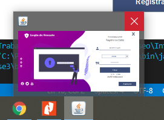
  <p>Cerrando desde la barra de tareas</p>
</div>

- **Nuestra aplicación no se mueve** de nuevo este problema se tratará en futuras clases.

- **Ahora hay mas espacio** efectivamente ahora nuestra aplicación tiene un poco mas de espacio por lo que ahora haremos unas pequeñas correcciones de posición para aprovechar este espacio. Recordar que aquí se muestra desordenado, sin embargo en el código estas modificaciones se hacen en orden en la respectiva configuración de su objeto gráfico.

```javascript
lEslogan.setLocation((pDerecha.getWidth() - lEslogan.getWidth()) / 2, 60);
lTituloLogin.setLocation((pDerecha.getWidth() - lTituloLogin.getWidth()) / 2, 80);
lNotificaciones.setLocation((pDerecha.getWidth() - lNotificaciones.getWidth()) / 2, 400);
lUsuario.setBounds(40, 140, 30, 30);
lClave.setBounds(40, 270, 30, 30);
tNombreUsuario.setLocation((pDerecha.getWidth() - tNombreUsuario.getWidth()) / 2, 130);
tClaveUsuario.setLocation((pDerecha.getWidth() - tClaveUsuario.getWidth()) / 2, 260);
cbTipoUsuario.setLocation((pDerecha.getWidth() - cbTipoUsuario.getWidth()) / 2, 210);
bEntrar.setLocation((pDerecha.getWidth() - bEntrar.getWidth()) / 2, 330);
bCerrar.setBounds(350, 10, 45, 30);
bRegistrarse.setBounds(240, 460, 145, 35);
lFacebook.setBounds(20, 460, 30, 30);
lTwitter.setBounds(60, 460, 30, 30);
lYoutube.setBounds(100, 460, 30, 30);
checkSi.setLocation((pDerecha.getWidth() - checkSi.getWidth()) / 2 - 15, 375);
checkNo.setLocation((pDerecha.getWidth() + checkNo.getWidth()) / 2 - 15, 375);
```

# Resultado

Finalmente nuestra interfaz de usuario con todos nuestros Objetos decoradores incorporados queda asi:

<div align="center">
  
  <p>Login de usuario Finalizado</p>
</div>

Si has llegado hasta aquí **!! felicitaciones !!**

Hemos creado nuestra primera interfaz gráfica con una vista amigable con nuestros usuarios, hemos aprendido como crear objetos gráficos y mostrarlos en pantalla ademas de como incorporar objetos decoradores para que nuestras interfaces gráficas luzcan mucho mejor.

En la siguiente clase vamos a hacer una parada sobre nuestras interfaces y vamos a explorar un poco nuestro código escrito ya que existen maneras de optimizar mucho más nuestro código.

# Actividad

Utiliza los objetos decoradores en tu login de usuario para que luzca mucho mas amigable a la vista de nuestros usuarios. Sube a Github los resultados y envía el link al correo:

cfpatinoc@correo.udistrital.edu.co
