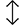

# Interfaz Gráfica en Java

Curso propuesto por el grupo de trabajo Semana de Ingenio y Diseño (**SID**) de la Universidad Distrital Francisco Jose de Caldas.

## Monitor

**Cristian Felipe Patiño Cáceres** - Estudiante de Ingeniería de Sistemas de la Universidad Distrital Francisco Jose de Caldas

# Clase 3

## Objetivos

- Identificar las etapas involucradas en la creación de objetos decoradores y como incorporarlos en objetos gráficos para dar un mejor aspecto la interfaz Gráfica.
- Reconocer la importancia de los objetos decoradores y el papel que toman para que una interfaz gráfica sea más amigable con los usuarios.
- Explorar cada uno de los objetos decoradores que ofrece Java Swing y el rol de cada uno para una personalización de las Interfaces gráficas.

# Antes de comenzar

Recordando la sesión anterior, se había creado una interfaz gráfica para un Login de usuario. El resultado fue el siguiente:

<div align="center">
  
  <p>Login de usuario creado en la sesión anterior</p>
</div>

# Objetos Decoradores

En esta clase se va a explorar la forma de crear e incorporar objetos decoradores para que el login de usuario tenga un mejor aspecto. Para esto se van a ver estos items principales:
* **Etapas de creación de Objetos Decoradores**
* **Creación de Objetos Decoradores**

# Etapas de creación de Objetos Decoradores

Los objetos decoradores también tienen ciertas etapas en su creación, aunque estas pueden variar un poco dependiendo de los casos, las etapas más comunes son:

## Declaración

La declaración de un objeto decorador consiste en indicarle al sistema que la clase donde se esta trabajando tendrá un atributo de algún tipo de estos objetos. La declaración tiene 3 partes, estas son:

- **Tipo Acceso:** El tipo de acceso sera a menudo privado ya que son atributos de la clase y se debe respetar el principio de encapsulamiento como se discutió en la primera clase.
- **Tipo de Objeto Decorador:** Se refiere a la clase del objeto que se va a crear (Color, Font, ImageIcon, Cursor son algunos ejemplos) y la generación de estas clases casi siempre van a necesitar la importación de la librería que soporte la creación del objeto, estas importaciones a menudo se hacen automáticamente dependiendo del IDE o editor de código.
- **Variable:** El nombre que el programador elija darle y sera esta el objeto por el cual se podrá acceder a sus métodos.

<div align="center">
  
  <p>Declaración de un objeto decorador</p>
</div>

## Ejemplificación

La ejemplificación de un objeto decorador consiste en darle un valor inicial al objeto y para esto es necesario llamar al constructor de la clase, **Cuando se realiza la ejemplificación de un objeto decorador al mismo tiempo se realiza la configuración del objeto**. Esto quiere decir que la ejemplificación va a variar según el tipo de objeto decorador que se este creando. Para esta sesión la ejemplificación se realizará dentro del **constructor** de la clase y serán los primeros objetos solo por debajo del método **super** en caso de que exista.

<div align="center">
  
  <p>Ejemplificación de un objeto decorador</p>
</div>

## Incorporación

Un objeto decorador no puede ser agregado directamente a la interfaz Gráfica, necesita ser incorporado a un objeto gráfico para que sea visible. La incorporación se realiza en la etapa de **configuración** de un objeto gráfico cuando se llama algún método relacionado con el uso del objeto decorador en cuestión, esto puede ser por ejemplo para dar un color de fondo, color de letra, estilo de letra o borde a un objeto gráfico. Por esta razón en lugar de adicionarse mas bien se incorporan a un objeto gráfico.

<div align="center">
  
  <p>Incorporación de un objeto decorador</p>
</div>

# Creación de Objetos Decoradores

En esta sección se verá la forma de crear objetos Decoradores para ser incorporados, basándose en las 3 etapas que se acabaron de explicar. Los objetos a explorar a continuación serán:

- **Color**
- **Font**
- **Cursor**
- **Border**
- **ImageIcon**

# Color

Estos objetos decoradores cumplen la función de proporcionar color a los objetos gráficos en pantalla.

Existen varias formas para crear colores en Java y a continuación se mencionan las mas importantes:

## Colores por defecto en Java

Java trae por defecto una paleta de colores y para poder ser usados solo basta con llamar la clase **Color** y al digitar . (punto) se desplegará una variedad de colores. Es importante que la librería que soporta la creación de los colores sea importada, esto se hace por defecto dependiendo del editor que se maneje. Cuando se usan los colores por defecto de Java **no es necesario realizar la declaración ni la ejemplificación del objeto**.

<div align="center">
  
  <p>Paleta de colores por defecto de Java</p>
</div>

## Colores Personalizados

Muchas veces se quieren colores personalizados que Java no trae por defecto y para esto es necesario realizar la creación del objeto decorador de tipo Color:

* **Declaración**
```javascript
// Al inicio de la clase
private Color colorAzul, colorGrisOscuro;
```

La variable (objeto) que se coloca para los objetos Color empezará con color en minúscula seguido del nombre de la variable.

* **Ejemplificación**
```javascript
// Dentro del constructor
colorAzul = new Color(60, 78, 120);
colorGrisOscuro = new Color(80, 80, 80);
```

Se puede observar que la notación para la configuración de un color esta basado en la creación de colores mediante el sistema RGB (Red, Green, Blue) proporcionando valores enteros que pueden ir desde 0 hasta 255. generando así la creación de una gran posibilidad de colores.

* **Incorporación**
```javascript
// Dentro del constructor
tNombreUsuario.setForeground(colorGrisOscuro);
tNombreUsuario.setBackground(Color.WHITE);
tNombreUsuario.setCaretColor(colorAzul);
```

En el anterior código se ve reflejada la incorporación de varios objetos de tipo Color para un TextField, siendo algunos de estos creados por el desarrollador y otros que vienen por defecto en Java.

## Colores con Transparencia

Java también admite la creación de objetos RGBA los cuales agregan un nuevo canal (Alfa) para configurar la transparencia del color con valores enteros que van desde 0 (siendo un color totalmente transparente) hasta 255 (siendo un color totalmente solido). Los pasos para la creación de ese tipo de colores es la misma que los colores personalizados que se acaban de crear.

<div align="center">
  
  <p>Color oscuro con transparencia casi total</p>
</div>

## Incorporación de los colores personalizados.

A continuación se muestran las partes del código donde se incorporan los colores personalizados creados anteriormente a los objetos gráficos. Cabe destacar que aunque aquí se ven todas las incorporaciones juntas, en el código estas incorporaciones se hacen en orden en la respectiva configuración de su objeto gráfico.

```javascript
// En la respectiva configuración del objeto gráfico
lEslogan.setForeground(colorGrisOscuro);

lTituloLogin.setForeground(colorGrisOscuro);

lNotificaciones.setForeground(colorGrisOscuro);

tNombreUsuario.setForeground(colorAzul);
tNombreUsuario.setCaretColor(colorGrisOscuro);

tClaveUsuario.setForeground(colorAzul);
tClaveUsuario.setCaretColor(colorGrisOscuro);

cbTipoUsuario.setForeground(colorAzul);

bEntrar.setBackground(colorAzul);
bEntrar.setForeground(Color.WHITE);

bRegistrarse.setBackground(colorAzul);
bRegistrarse.setForeground(Color.WHITE);
```

Hasta el momento la Interfaz Gráfica se ve asi:

<div align="center">
  
  <p>Login de usuario con incorporación de colores</p>
</div>

# Font

Un objeto decorador Font se encarga de darle características gráficas a los textos vistos en la interfaz gráfica, para agregar dichas características un objeto Font se encarga de proporcionar 3 elementos:

- **Tipografía:** Da un nuevo aspecto a la letra de acuerdo a la tipografía seleccionada, la tipografía por defecto depende del sistema operativo que corra la aplicación. Para que una tipografía diferente pueda verse reflejada en la interfaz debe estar instalada previamente en el sistema operativo, una solución a esto es registrar la fuente dentro del **GraphicsEnvironment** de Java (más adelante se habla de este punto).
- **Estilo letra:** Da un estilo a la letra de acuerdo a la configuración dada, esta podría ser por ejemplo **negrilla** _cursiva_ <u>subrayado</u> etc.
- **Tamaño de la fuente:** Le da el tamaño de la fuente dependiendo del numero entero que reciba como parámetro.

A continuación se crean los objetos Font que se utilizarán para el Login de usuario:

* **Declaración**
```javascript
// al inicio de la clase
private Font fontTPrincipal, fontTitulo, fontSubtitulo;
```

La variable (objeto) que se coloca para los objetos Font empezará con font en minúscula seguido del nombre de la variable.

* **Ejemplificación**
```javascript
fontTPrincipal = new Font("Rockwell Extra Bold", Font.PLAIN, 20);
fontTitulo = new Font("Calibri (Cuerpo)", Font.BOLD, 17);
fontSubtitulo = new Font("Forte", Font.PLAIN, 13);
```

Se puede observar que al momento de ejemplificar el objeto se realiza su respectiva configuración desde el constructor pasando los 3 parámetros ya mencionados con anterioridad. Algunos puntos a resaltar son:

- La tipografía dada debe estar en comillas.
- Los diferentes estilos se pueden observar llamando a la clase Font y poniendo un . (punto).
- El tamaño de la letra será siempre un numero entero.
<div align="center">
  
  <p>Ejemplificación de objetos decoradores tipo Font</p>
</div>

* **Incorporación**
A continuación se muestran las partes del código donde se incorporan los objetos decoradores Font. Recordar que aquí se muestran seguidas, sin embargo en el código estas incorporaciones se hacen en orden en la respectiva configuración de su objeto gráfico.

```javascript
// En la respectiva configuración del objeto gráfico
lTituloApp.setFont(fontTPrincipal);
lEslogan.setFont(fontSubtitulo);
lTituloLogin.setFont(fontTitulo);
lNotificaciones.setFont(fontSubtitulo);
```

Se puede observar que para realizar la incorporación de las fuentes se debe llamar el método:

- **setFont** que recibe por parámetro un objeto decorador tipo Font y refleja un estilo en la letra del objeto gráfico.

La aplicación luce asi:

<div align="center">
  
  <p>Login de usuario con incorporación de fuentes</p>
</div>

## Registro de fuentes en el GraphicsEnvironment

Aunque al incorporar algunas fuentes en el proyecto UI estas se verán reflejadas sin problema en la maquina que se corre, es posible que en otros computadores, estas no se vean reflejadas ya que el sistema operativo no tiene instaladas dichas fuentes, por otra parte es molesto tener que instalar las fuentes que se utilicen en cada maquina nueva que se ejecute la aplicación. 

Para esto es posible registrar la fuente en el **GraphicsEnvironment** de Java y de esta forma las fuentes estarán siempre incorporadas en la aplicación sin afectar en que sistema se corra. 

Lo primero que se debe hacer es colocar los archivos de las fuentes a usar dentro del proyecto, para esto se crea un paquete llamado **resources** que estará en la raíz del proyecto junto a la carpeta **src** y dentro de este otro paquete llamado **fonts**.

<div align='center'>
  
  <p>Nuevo paquete para incorporar fuentes.</p>
</div>

Allí se colocan los archivos de las fuentes que por lo general tienen una extensión **.TTF** para este ejemplo se guardara la fuente **LuzSans-Book** que se descargo desde internet.

<div align='center'>
    
    <p>Archivo TTF dentro del paquete fonts</p>
</div>

Ahora se crea un nuevo método en la clase **LoginTemplate** el cual se llamará **generarFuentes**:

```javascript
private void generarFuentes() {
}
```

Dentro se va a ejemplificar un objeto tipo **GraphicsEnvironment** este objeto se encarga de guardar todas las configuraciones globales de nuestra aplicación, para ejemplificar este objeto se debe llamar al método **getLocalGraphicsEnvironment** y ademas se crea un Try/Catch para controlar un posible error al generar la fuente:

```javascript
private void generarFuentes() {
  try {
    GraphicsEnvironment ge = GraphicsEnvironment.getLocalGraphicsEnvironment();

  } catch (IOException | FontFormatException e) {
    System.out.println(e);
  }
}
```

Ahora se debe indicar al objeto de entorno gráficos que se registrará una nueva fuente con el método **registerFont**:

```javascript
private void generarFuentes() {
  try {
    GraphicsEnvironment ge = GraphicsEnvironment.getLocalGraphicsEnvironment();
    ge.registerFont();
  } catch (IOException | FontFormatException e) {
    System.out.println(e);
  }
}
```

Dentro del método se crea la nueva fuente a registrar con el método **createFont** del objeto Font, este método pedirá por parámetro:
* **Formato de la fuente**: El tipo de estilo de la fuente, normalmente se escoge la opción **TRUETYPE_FONT** para no alterar la fuente.
* **Archivo de la fuente**: Es un objeto normalmente de tipo **File** que contiene el archivo de la fuente y se le debe pasar la dirección de donde se encuentra.

```javascript
private void generarFuentes() {
  try {
    GraphicsEnvironment ge = GraphicsEnvironment.getLocalGraphicsEnvironment();
    ge.registerFont( Font.createFont(
        Font.TRUETYPE_FONT,
        new File("Clase3/resources/fonts/LUZRO.ttf")
    ));
  } catch (IOException | FontFormatException e) {
    System.out.println(e);
  }
}
```

Por cada fuente que se necesite registrar se debe llamar al método **registerFont** y hacer el mismo procedimiento. Algo a aclarar es que muchas fuentes por lo general tienen un nombre distinto al nombre del archivo, en este caso por ejemplo el archivo de la fuente es **LUZRO**, sin embargo el sistema reconocerá la fuente como **LuzSans-Book** asi que es recomendable leer la documentación de la fuente a descargar.

Ahora se debe llamar al método desde el constructor, y se debe llamar antes de la ejemplificación de los objetos decoradores, o de lo contrario al crear una fuente con esta tipografía pero aun sin ser registrada no se verá reflejada:
```javascript
public LoginTemplate() {
  this.generarFuentes();

  ...
  ...
}
```

Para probar la nueva fuente registrada se va a crear una nueva fuente que se usará en el futuro para otras partes del proyecto. Aunque en el login no tendrá uso se utilizará momentáneamente en el label del titulo para verificar su correcta incorporación.

* **Declaración:**
```javascript
// Al inicio de la clase
private Font fontMediana;
```

* **Ejemplificación**
```javascript
fontMediana = new Font("LuzSans-Book", Font.PLAIN, 15);
```

* **Incorporación:**
```javascript
tNombreUsuario.setFont(fontMediana);
```

<div align='center'>
    
    <p>Registro de fuente exitosa.</p>
</div>

Ahora no importa en que sistema se ejecute la aplicación, el programa siempre registrará la fuente y podrá usarla en cualquier entorno.

***Nota:** Recordar dejar la fuente del titulo que tenia antes.*

# Cursor

Los cursores son todas las formas que pueden tomar el puntero del Mouse mientras pasa por alguna zona de la ventana, por ejemplo es común ver un icono de una mano cuando se pasa por un botón, una cruz cuando se esta trabajando en un espacio de gráficos (Paint por dar un ejemplo) un icono de bloqueo cuando no se pueda dar click en una parte etc.

* **Declaración**
```javascript
private Cursor cMano;
```

La variable (objeto) que se coloca para los objetos Cursor empezará con c en minúscula seguido del nombre de la variable.

* **Ejemplificación**
```javascript
cMano = new Cursor(Cursor.HAND_CURSOR);
```

Java proporciona una totalidad de 15 opciones de cursores para incorporar en las Interfaces de usurario, a continuación se muestran algunos de los mas importantes.

| Cursor           | Descripción                                       | imágen                        |
| ---------------- | ------------------------------------------------- | ----------------------------- |
| CROSSHAIR_CURSOR | Cursor en forma de Cruz                           |    |
| DEFAULT_CURSOR   | Puntero en forma de flecha que esta por defecto   |  |
| E_RESIZE_CURSOR  | Cursor con dos flechas unidas de forma horizontal |  |
| N_RESIZE_CURSOR  | Cursor con dos flechas unidas de forma Vertical   |  |
| HAND_CURSOR      | Cursor con una mano                               |     |
| MOVE_CURSOR      | Cursor en forma de Cruz con punta de flechas      |     |
| TEXT_CURSOR      | Cursor en forma de linea para texto               |     |
| WAIT_CURSOR      | Cursor en forma circular para esperar             |     |


* **Incorporación**

A continuación se muestran las partes del código donde incorporamos los objetos decoradores Cursor. Recordar que aquí se muestra todo junto, sin embargo, en el código estas incorporaciones se hacen en orden en la respectiva configuración de su objeto gráfico.

```javascript
// En la respectiva configuración del objeto gráfico
bEntrar.setCursor(cMano);
bCerrar.setCursor(cMano);
bRegistrarse.setCursor(cMano);
bOpcion1.setCursor(cMano);
bOpcion2.setCursor(cMano);
bOpcion3.setCursor(cMano);
checkSi.setCursor(cMano);
checkNo.setCursor(cMano);
```

Se puede observar que el método para incorporar este objeto decorador es:

- **setCursor:** Recibe por parámetro un objeto de tipo Cursor y se ve reflejado cuando el usuario pasa por encima del objeto gráfico con el Mouse cambiando el icono del puntero.

Ahora la interfaz gráfica tiene interactividad con el Mouse cada que el usuario pasa por los botones:

<div align="center">
  
  <p>Login de usuario con incorporación de Cursores</p>
</div>

# Borders

Los borders son aquellos que resaltan los limites de espacio de los objetos gráficos y existen una gran variedad de bordes para ser incorporados. A continuación se muestran los bordes mas importantes y cabe resaltar que la declaración e incorporación son muy similares por lo que solo se explicará la ejemplificación de los diferentes bordes.

* **Declaración**
___
```javascript
// Al inicio de la clase
private Border bInferiorAzul;
```

La variable (objeto) que se coloca para los objetos Border empezará con b en minúscula seguido del nombre de la variable.

**Nota:** 

A veces por defecto el IDE o editor de código importa la librería:
```javascript
import javafx.scene.layout.Border;
```
Pero esa librería no va a funcionar y nos va a traer problemas. La librería correcta es:
```javascript
import javax.swing.border.Border;
```

* **Ejemplificación**
___
A continuación se muestran los diferentes bordes que pueden crearse usando un único objeto (border) para mostrar la variedad de estos, sin embargo para el login solo se utilizará un tipo de estos bordes.

## **BorderFactory**

Antes de mostrar los diferentes bordes se debe importar otra librería más, esta es la librería **borderFactory** de Swing que dará la posibilidad de crear los borders.

```javascript
import javax.swing.BorderFactory;
```

## **LineBorder**

Dibuja en los limites del objeto gráfico un borde con una linea:

```javascript
border = BorderFactory.createLineBorder(colorAzul, 2, true);
```

Se puede observar que para crear un borde se debe llamar primero a la clase **BorderFactory** y seleccionar el método **createLineBorder**.

Los parámetros que recibe son:
- **Color de linea:** Recibe un objeto decorador tipo Color y representa el color de la linea.
- **Grosor:** Recibe un numero entero que representa el grosor de la linea.
- **Bordes redondos:** Recibe un booleano para indicar si quiere que las esquinas del borde estén redondeadas o no. El cambio será muy mínimo, si coloca true y no ve el cambio no hay por que preocuparse.

* **Resultado:**

<div align="center">
  
  <p>LineBorder en un JTextField</p>
</div>

## **LoweredBevelBorder**

Dibuja un borde basado en sombras para crear un efecto en el cual el objeto gráfico pareciera estar hundido con respecto a la ventana. Este efecto se consigue dibujando las sombras en la parte superior izquierda del objeto gráfico. Existen dos variaciones **LoweredBevelBorder** o **LoweredSoftBevelBorder**, según la propia Documentación de Java la variación con el **Soft** genera sombras mas suaves en las esquinas sin embargo es difícil notar la diferencia.

Una desventaja de este tipo de bordes es que solo se notara cuando la ventana o panel donde esta el objeto gráfico tiene el color por defecto (gris) de lo contrario solo se vera con dos lineas en la parte izquierda y superior.

```javascript
border = BorderFactory.createLoweredBevelBorder();
```

Se observa que para crear el borde se debe llamar primero a la clase **BorderFactory** y se selecciona el método **createLoweredBevelBorder**.

* **Resultado:**

<div align="center">
  
  <p>LoweredBevelBorder en un JTextField</p>
</div>

## **RaisedBevelBorder**

Dibuja un borde basado en sombras para crear un efecto en el cual el objeto gráfico pareciera estar por encima con respecto a la ventana. Este efecto se consigue dibujando las sombras en la parte inferior derecha del objeto gráfico. Existen dos variaciones **RaisedBevelBorder** o **RaisedSoftBevelBorder**, según la propia Documentación de Java la variación con el **Soft** genera sombras mas suaves en las esquinas sin embargo es difícil notar la diferencia.

De nuevo la desventaja de este tipo de bordes es que solo se notara cuando la ventana o panel donde esta el objeto gráfico tiene el color por defecto (gris) de lo contrario solo se vera con dos lineas en la parte derecha e inferior.

```javascript
border = BorderFactory.createRaisedBevelBorder();
```

Se puede observar que para crear el borde se debe llamar primero a la clase **BorderFactory** y luego seleccionar el método **createRaisedBevelBorder**.

* **Resultado:**

<div align="center">
  
  <p>RaisedBevelBorder en un JTextField</p>
</div>

## **BevelBorder**

Una buena solución al las desventajas de los bordes anteriores puede ser este borde, que en realidad es una combinación y mejora de los dos anteriores, este borde recibe colores en su constructor lo que hace que pueda ser usado sobre cualquier color de fondo. Entonces un BevelBorder se caracteriza por dibujar 4 lineas:

- **Linea Externa Lower:** dibuja una linea en la parte superior y en la parte izquierda del objeto y estará en el la parte externa.
- **Linea Interna Lower:** dibuja una linea en la parte superior y en la parte izquierda del objeto y estará en el la parte interna.
- **Linea Externa Raise:** dibuja una linea en la parte inferior y en la parte derecha del objeto y estará en el la parte externa.
- **Linea Interna Raise:** dibuja una linea en la parte inferior y en la parte derecha del objeto y estará en el la parte interna.

De igual manera este tipo de borde tiene dos variaciones **BevelBorder** y **SoftBevelBorder** que como comentamos da un suavizado en las esquinas pero el cambio no es muy notorio.

```javascript
border = BorderFactory.createBevelBorder(
  BevelBorder.RAISED,
  Color.LIGHT_GRAY,
  colorGrisOscuro,
  Color.LIGHT_GRAY,
  Color.WHITE
);
```

Se observa que para crear el borde se debe llamar primero a la clase **BorderFactory** y seleccionar el método **createBevelBorder**.

Este recibe por parámetros:
- **Tipo borde Bevel:** recibe un tipo de borde tipo Bevel (Lower o Raised) y en realidad lo que hace esta configuración es cambiar el orden de los colores que va a recibir por parámetro dependiendo de la elección.
- **Color Externo1:** Recibe un objeto decorador tipo Color y representa el color externo ya sea del Lower o el Raise
- **Color Interno1:** Recibe un objeto decorador tipo Color y representa el color interno que acompaña al color externo 1 ya sea del Lower o el Raise
- **Color Externo2:** Recibe un objeto decorador tipo Color y representa el color externo del contrario a la opción escogida.
- **Color Interno2:** Recibe un objeto decorador tipo Color y representa el color interno que acompaña al color externo 2.

Cabe destacar que con este borde se puede el efecto de **Hundido** o **Encima** o también es posible generar otros efectos con la combinación de varios colores.

* **Resultados:**

<div align="center">
  
  <p>BevelBorder en un JTextField</p>
</div>

<div align="center">
  
  <p>BevelBorder en un JTextField con colores</p>
</div>

## **EtchedBorder**

Este tipo de borde dibuja 2 LineBorder en el objeto gráfico dejando así una linea interna y una linea externa que se intercalan entre si. Este tipo de bordes da un buen efecto de difuminado pequeño o de iluminado si se usan los colores correctos.

```javascript
border = BorderFactory.createEtchedBorder(EtchedBorder.RAISED, Color.ORANGE, Color.YELLOW);
```

Se puede observar que para crear el borde se debe llamar primero a la clase **BorderFactory** y seleccionar el método **createEtchedBorder**.

Este recibe por parámetros:
- **Tipo borde Etched:** recibe un tipo de borde tipo Etched (Lower, Raised) y en realidad lo que hace esta configuración es cambiar el orden de los colores que va a recibir por parámetro dependiendo de la elección.
- **Color:** Recibe un objeto decorador tipo Color y representa el color de una de las lineas del borde que en una parte será externa pero en otra interna.
- **Color:** Recibe un objeto decorador tipo Color y representa el color de una de las lineas del borde que en una parte será externa pero en otra interna.

* **Resultado:**

<div align="center">
  
  <p>EtchedBorder en un JTextField</p>
</div>

## **MatteBorder**

Este es uno de los bordes más usados y aunque su configuración es simple se puede sacar gran provecho de este. Dibuja una linea en los lados que se le indique, por ejemplo para un panel en la parte izquierda seria bueno un borde en la parte derecha nada mas indicando la separación y con este tipo de Border se puede lograr.

```javascript
border = BorderFactory.createMatteBorder(0, 0, 3, 0, colorAzul);
```

Se puede observar que para crear el borde se debe llamar primero a la clase **BorderFactory** y seleccionar el método **createMatteBorder**.

Este recibe por parámetros:
- **Grosor en la linea superior:** Recibe un numero entero que indica el grosor en la linea superior.
- **Grosor en la linea izquierda:** Recibe un numero entero que indica el grosor en la linea izquierda.
- **Grosor en la linea inferior:** Recibe un numero entero que indica el grosor en la linea inferior.
- **Grosor en la linea derecha:** Recibe un numero entero que indica el grosor en la linea derecha.
- **Color del borde:** Recibe un objeto decorador tipo Color y representa el color de la linea del borde.

* **Ejemplo**

<div align="center">
  
  <p>MatteBorder en un JTextField</p>
</div>

## **DashedBorder**

Dibuja un tipo de borde con una linea punteada o intermitente para limitar el objeto gráfico.

```javascript
border = BorderFactory.createDashedBorder(colorAzul, 2, 3, 2, true);
```

Se observa que para crear el borde se debe llamar primero a la clase **BorderFactory** y seleccionar el método **createDashedBorder**.

Este recibe por parámetros:
- **Color del borde:** Recibe un objeto decorador tipo Color y representa el color de la linea del borde.
- **Grosor de la linea:** Recibe un numero entero que indica el grosor de la linea.
- **Largo de las lineas:** Recibe un numero entero que indica el largo de cada una de las lineas intermitentes.
- **Espacio entre lineas:** Recibe un numero entero que indica el espacio que hay entre las lineas.
- **Bordes redondeados:** Recibe un booleano que si se deja como True pondrá los bordes redondeados, sin embargo el efecto es poco notorio.

* **Resultado:**

<div align="center">
  
  <p>DashedBorder en un JTextField</p>
</div>

## **EmptyBorder**

Este borde crea un borde vació en los objetos gráficos y es muy util cuando se quiere generar un espacio entre los limites del objeto gráfico y el contenido de este, creando un **Padding** gracias a este borde, ya que cuando se crea un borde este, en lugar de ocupar mas espacio externamente en un objeto gráfico, en realidad ocupa espacio internamente.

```javascript
border = new EmptyBorder(2, 20, 2, 2);
```

Se observa que para crear el borde no es necesario llamar al **BorderFactory** simplemente se crea bajo el objeto tipo **EmptyBorder**.

Este recibe por parámetros:
- **Grosor de borde superior:** Recibe un numero entero que indica el grosor del borde o espacio en la parte superior.
- **Grosor de borde izquierdo:** Recibe un numero entero que indica el grosor del borde o espacio en la parte izquierda.
- **Grosor de borde inferior:** Recibe un numero entero que indica el grosor del borde o espacio en la parte inferior.
- **Grosor de borde derecho:** Recibe un numero entero que indica el grosor del borde o espacio en la parte derecha.

## **CompoundBorder**

Es un Border compuesto que recibe como parámetro dos objetos Borders y los combina, dejando un borde interno y otro borde externo.

A continuación se muestra una implementación de este borde con la combinación de varios LineBorders para dar un efecto difuminado.

<div align="center">
  
  <p>Implementación de CompoundBorder</p>
</div>

Se observa que para crear este tipo de borde se debe llamar primero a la clase **BorderFactory** y seleccionar el método **createCompoundBorder**.

Este recibe por parámetros:

- **Borde Interno:** Recibe un objeto tipo Border y representa el borde interno.
- **Borde Externo:** Recibe un objeto tipo Border y representa el borde Externo.

* **Resultado:**

<div align="center">
  
  <p>Ejemplo de un CompoundBorder en un JPanel</p>
</div>

* **Incorporación**
___
A continuación se muestra el borde que se usa para la ventana y las incorporaciones de este en el código. También mostraremos algunas correcciones en la posición de los objetos gráficos para que tengan un mejor aspecto con la incorporación del borde. Recordar que aquí se muestra todo junto, sin embargo en el código estas incorporaciones se hacen en orden en la respectiva configuración de su objeto gráfico.

```javascript
bInferiorAzul = BorderFactory.createMatteBorder(0, 0, 2, 0, colorAzul);
```

```javascript
tNombreUsuario.setBorder(bInferiorAzul);
tClaveUsuario.setBorder(bInferiorAzul);
cbTipoUsuario.setLocation((pDerecha.getWidth() - cbTipoUsuario.getWidth()) / 2, 195);
```

Hasta el momento la interfaz estará así:

<div align="center">
  
  <p>Login de usuario con la incorporación de bordes</p>
</div>

# ImagenIcon

Las imágenes en las ventanas son quizás el objeto decorador determinante para que una interfaz gráfica luzca mucho más amigable con los usuarios. A continuación se ve la creación de estos objetos decoradores y la incorporación en la interfaz de Login para resaltar su importancia.

## Antes de comenzar

Es importante tener todos los recursos dentro de un paquete en el proyecto. Para esto crearemos una carpeta llamada **images** que estará dentro del paquete **resources**, allí es donde se guardan las imágenes e iconos a usar.

<div align="center">
  
  <p>Carpeta resources dentro del proyecto</p>
</div>

<div align="center">
  
  <p>Carpeta images dentro de la carpeta resources</p>
</div>

<div align="center">
  
  <p>imágenes que vamos a usar en la interfaz</p>
</div>

**Nota**

Algunas de estas imágenes tienen un numero al final ya que más adelante en el curso se añadirán variaciones de estas mismas imágenes. Por otro lado estas imágenes pueden ser descargadas desde este mismo repositorio, entrando a la carpeta **Clase3** seguido de la carpeta a **resources/images** y ahi se prodran ver y descargar cada una de las imágenes.

<div align="center">
  
  <p>Carpeta clase3 dentro del repositorio</p>
</div>

<div align="center">
  
  <p>Carpeta resources dentro del repositorio</p>
</div>

<div align="center">
  
  <p>Carpeta images dentro del repositorio</p>
</div>

<div align="center">
  
  <p>Lista de imágenes dentro del repositorio</p>
</div>

<div align="center">
  
  <p>Descarga de imágenes dentro del repositorio</p>
</div>

* **Declaración**
```javascript
private ImageIcon iFondo, iSvg1, iLogo, iUsuario, iClave, iPunto1, iFacebook1, iTwitter1, iYoutube1, iCerrar, iDimAux;
```

La variable (objeto) que se coloca para los objetos ImageIcon empezará con i en minúscula seguido del nombre de la variable. En este caso algunas variables se les añadió un 1 al final ya que mas adelante en el curso se usarán algunas variaciones de esas mismas imágenes.

* **Ejemplificación**

A continuación se muestra la ejemplificación y configuración de los objetos Decoradores tipo ImageIcon:

```javascript
iFondo = new ImageIcon("Clase3/resources/img/fondo.png");
iLogo = new ImageIcon("Clase3/resources/img/logo.png");
iUsuario = new ImageIcon("Clase3/resources/img/usuario.png");
iClave = new ImageIcon("Clase3/resources/img/clave.png");
iPunto1 = new ImageIcon("Clase3/resources/img/punto1.png");
iFacebook1 = new ImageIcon("Clase3/resources/img/facebook1.png");
iTwitter1 = new ImageIcon("Clase3/resources/img/twitter1.png");
iYoutube1 = new ImageIcon("Clase3/resources/img/youtube1.png");
iSvg1 = new ImageIcon("Clase3/resources/img/imagen1.png");
iCerrar = new ImageIcon("Clase3/resources/img/cerrar.png");
```

Se puede observar que al momento de ejemplificar el objeto decorador ImageIcon, este recibe por parámetro un String que en realidad representa
la dirección donde esta contenida la imágen. También es importante fijarse en la extensión de la imágen en este ejemplo todas son **.png** pero Java también soporta **.jpg**, **.gif** etc.

**Otro punto importante que hay que resaltar es que la dirección puede variar entre IDEs y editores de código, por ejemplo estas direcciónes funcionan en el editor de texto Visual Studio Code. Pero en NetBeans por ejemplo habría que quitar en la dirección la parte "Clase3/" y empezar por "resources/.."**

* **Incorporación**

Como un ImageIcon es un objeto decorador, este no se puede agregar directamente a la ventana, necesitamos un objeto gráfico como intermediario para ser mostrado. Una manera de realizar esto es mediante la creación de labels que contengan estas imágenes. Ya que los JLabel por defecto traen un fondo transparente y esto es de gran utilidad. Por lo que se van a crear los JLabel correspondientes:

## Declaración objetos JLabel

```javascript
private JLabel lFondo, lSvg1, lLogo, lUsuario, lClave, lFacebook, lTwitter, lYoutube;
```

## Ejemplificación y Configuración y Adición objetos JLabel

Se va a ver primero el ejemplo con uno de los labels para explicar unos **aspectos importantes**.

Se va a añadir un fondo a la interfaz, lo primero que se hace es poner el color de fondo del panel pIzquierda a blanco:

```javascript
pIzquierda.setBackground(Color.white);
```

Asi se ve la interfaz:

<div align="center">
  
  <p>Login de usuario cambiando el color de fondo al pIzquierda</p>
</div>

Ahora se va a Ejemplificar y configurar el objeto JLabel.

Una pregunta valida en este punto puede ser:
**¿Si se quiere una imágen de fondo, por que no incorporarla al JPanel directamente?**

Esto es debido a que los JPanel no tienen la propiedad de incorporar una imágen. Por eso se hace por medio de un JLabel.

```javascript
// dentro del constructor
lFondo = new JLabel();
lFondo.setBounds(0, 0, 600, 600);
lFondo.setIcon(iFondo);
pIzquierda.add(lFondo);
```

Se puede observar que el método para incorporar un objeto decorador tipo ImageIcon es:

- **setIcon:** Recibe por parámetro un objeto decorador ImageIcon y representa la imágen que se añade a la ventana.

### **Aspecto 1: Orden de objetos mostrados en pantalla**

Una pregunta realmente importante que hay que hacerse es **¿En que parte del constructor se debe colocar la creación del nuevo JLabel?** Y esta pregunta es valida por que si por ejemplo se pone este fragmento de código justo después de la creación de los JPanel ocurre lo siguiente:

<div align="center">
  
  <p>Login de usuario agregando imágen de fondo justo después de la creación de los paneles</p>
</div>

Se puede observar que la imágen de fondo quedo encima del Label que daba el titulo a la aplicación y encima de los botones ubicados en la parte izquierda. Y es por que Java **pondrá los elementos uno detrás de otro en el eje Z a medida que se vayan añadiendo.** Por lo que si queremos que la imágen quede en el fondo tendremos que ponerla de ultimas justo después de los últimos botones que habíamos adicionado en el panel pIzquierda:

<div align="center">
  
  <p>Orden en código de elementos en pIzquierda para que la imágen quede en el fondo de la ventana</p>
</div>

De esta manera la interfaz quedara asi:

<div align="center">
  
  <p>Login de usuario agregando imágen de fondo justo después de la creación del ultimo objeto gráfico adicionado en pIzquierda</p>
</div>

### **Aspecto 2: Redimensión de las imágenes**

Se observa que en la interfaz la imágen de fondo quedo incorporada, sin embargo, no quedo como se esperaba. Esto es debido a que la imágen es de dimensiones mucho mas grandes que las de la ventana asi que será buena idea redimensionarla.

Una posible forma de redimensión sería de forma manual con algún programa como photoshop, sin embargo, esto no es nada optimo y menos si hay una gran cantidad de imágenes por redimensionar.

La mejor forma es hacerlo en el código y para esto necesitamos de un objeto auxiliar:

<div align="center">
  
  <p>Objeto Auxiliar</p>
</div>

Antes de poder realizar la redimensión necesitamos agregar una librería más en el código:

```javascript
import java.awt.Image;
```

Para realizar esta redimension realizaremos este código justo encima de la creación del JLabel que contiene la imágen de fondo:

```javascript
iDimAux = new ImageIcon(iFondo.getImage().getScaledInstance(600, 600, Image.SCALE_AREA_AVERAGING));

lFondo = new JLabel();
...
...
```

Se puede observar que se esta realizando una ejemplificación de un objeto decorador ImageIcon, sin embargo no está recibiendo ninguna ruta, este esta recibiendo por parámetro otro objeto ImageIcon y se están llamando el siguiente método:

- **getImage:** que nos trae el Objeto **Image** del ImageIcon, esto se realiza para poder obtener las propiedades del objeto tipo **Image** como la **redimension** ya que el objeto ImageIcon no cuenta con esta propiedad dentro de su configuración.

Una vez con el objeto **Image** se procede a llamar el método:

- **getScaledInstance:** que se encarga de redimensionar la imágen al tamaño que se indique y recibe estos parámetros:
  - **ancho:** Un numero entero que representa el nuevo ancho de la imágen
  - **alto:** Un numero entero que representa el nuevo alto de la imágen
  - **sistema de escala:** Es un sistema interno de la clase **Image** que se encarga de re acomodar los pixeles. Existen varias opciones para escalar los pixes (**SCALE_AREA_AVERAGING, SCALE_DEFAULT, SCALE_REPLICATE** etc). sin embargo el que por experiencia da mejores resultados es el **SCALE_AREA_AVERAGING**

Si se ejecuta la aplicación es posible observar que la imágen sigue igual **¿por qué?**, ya que nos falto cambiar el ImageIcon en el label, ahora este debe incorporar el ImageIcon **iDimAux** quien es el que contiene la imágen redimensionada.

```javascript
lFondo.setIcon(iDimAux);
```

Y ahora la interfaz se verá así:

<div align="center">
  
  <p>Login de usuario con imágen de fondo redimensionada</p>
</div>

## Creando los otros label para mostrar en la Interfaz

A continuación se muestra la creación de los objetos JLabel que incorporan las imágenes repitiendo el proceso que vimos anteriormente. Recordar que aunque se muestre el código aquí todo junto en la aplicación se ponen en el orden de tal manera que tenemos presente la organización de objetos con respecto al eje Z.

```javascript
iDimAux = new ImageIcon(iLogo.getImage().getScaledInstance(40, 40, Image.SCALE_AREA_AVERAGING));

lLogo = new JLabel();
lLogo.setBounds(50, 20, 40, 40);
lLogo.setIcon(iDimAux);
pIzquierda.add(lLogo);
```

```javascript
iDimAux = new ImageIcon(iSvg1.getImage().getScaledInstance(500, 345, Image.SCALE_AREA_AVERAGING));

lSvg1 = new JLabel();
lSvg1.setBounds(100, 100, 500, 345);
lSvg1.setIcon(iDimAux);
pIzquierda.add(lSvg1);
```

```javascript
iDimAux = new ImageIcon(iFacebook1.getImage().getScaledInstance(30, 30, Image.SCALE_AREA_AVERAGING));

lFacebook = new JLabel();
lFacebook.setBounds(20, 420, 30, 30);
lFacebook.setIcon(iDimAux);
pIzquierda.add(lFacebook);

iDimAux = new ImageIcon(iTwitter1.getImage().getScaledInstance(30, 30, Image.SCALE_AREA_AVERAGING));

lTwitter = new JLabel();
lTwitter.setBounds(60, 420, 30, 30);
lTwitter.setIcon(iDimAux);
pIzquierda.add(lTwitter);

iDimAux = new ImageIcon(iYoutube1.getImage().getScaledInstance(30, 30, Image.SCALE_AREA_AVERAGING));

lYoutube = new JLabel();
lYoutube.setBounds(100, 420, 30, 30);
lYoutube.setIcon(iDimAux);
pIzquierda.add(lYoutube);
```

```javascript
iDimAux = new ImageIcon(iUsuario.getImage().getScaledInstance(30, 30, Image.SCALE_AREA_AVERAGING));

lUsuario = new JLabel();
lUsuario.setBounds(40, 130, 30, 30);
lUsuario.setIcon(iDimAux);
pDerecha.add(lUsuario);

iDimAux = new ImageIcon(iClave.getImage().getScaledInstance(30, 30, Image.SCALE_AREA_AVERAGING));

lClave = new JLabel();
lClave.setBounds(40, 250, 30, 30);
lClave.setIcon(iDimAux);
pDerecha.add(lClave);
```

Con estas adiciones en el código la interfaz gráfica queda asi:

<div align="center">
  
  <p>Login de usuario con incorporación de ImageIcon</p>
</div>

## Agregando imágenes en botones

**!Ya falta poco!** Ahora hay dos imágenes que no se han incorporado aun, estas se van a incorporar en los botones, bCerrar y bOpcion1, bOpcion2, bOpcion3.

Se empieza por los botones opciones, la imágen que se quiere incorporar esta contenida en el objeto decorador iPunto.

Primero se redimensiona la imágen par a luego incorporarla en los botones:

```javascript
iDimAux = new ImageIcon(iPunto1.getImage().getScaledInstance(20, 20, Image.SCALE_AREA_AVERAGING));

bOpcion1.setIcon(iDimAux);
bOpcion2.setIcon(iDimAux);
bOpcion3.setIcon(iDimAux);
```

Los botones se verán asi:

<div align="center">
  
  <p>Botones con incorporación de ImageIcon</p>
</div>

Sin embargo esto no es lo deseado, para empezar se quiere que los botones queden con un fondo transparente. Esto lo haremos con el siguiente método:

```javascript
bOpcion1.setContentAreaFilled(false);
bOpcion2.setContentAreaFilled(false);
bOpcion3.setContentAreaFilled(false);
```

- **setContentAreaFilled:** Recibe por parámetro un booleano que por defecto esta en True, si se cambia a false este quitara ciertas propiedades de los botones que traen por defecto en Java como el color por defecto en gris y la iluminación cada vez que se pasa encima de el.

Los botones ahora están asi:

<div align="center">
  
  <p>Botones sin propiedades content Area</p>
</div>

Sin embargo tienen unas lineas que rodean a la imágen que no se quieren ver, esto es por que por defecto los botones tienen un borde, se debe retirar y además no se le ha quitado la propiedad focusable:

```javascript
bOpcion1.setFocusable(false);
bOpcion1.setBorder(null);

bOpcion2.setFocusable(false);
bOpcion2.setBorder(null);

bOpcion3.setFocusable(false);
bOpcion3.setBorder(null);
```

<div align="center">
  
  <p>Botones sin borde ni la propiedad focusable</p>
</div>

Ya esta hecho ! ahora se repite el proceso para el botón bCerrar:

```javascript
iDimAux = new ImageIcon(iCerrar.getImage().getScaledInstance(30, 30, Image.SCALE_AREA_AVERAGING));

bCerrar = new JButton(); // Se quita el texto que tenia al inicio
bCerrar.setIcon(iDimAux);
bCerrar.setContentAreaFilled(false);
bCerrar.setFocusable(false);
bCerrar.setBorder(null);
```

La Interfaz Luce asi:

<div align="center">
  
  <p>Login de usuario con incorporación de ImageIcon</p>
</div>

# Decoraciones Adicionales

A continuación y para acabar se van a realizar unas pequeñas modificaciones y adiciones en el código para darle los toques finales.

## Quitar la barra por defecto en Java

En la primera clase se menciono este método pero es la hora de usarse, en la configuración de la ventana se añade el método:

```javascript
setUndecorated(true);
```

Notamos como la interfaz ya no cuenta con la barra por defecto de Java, ahora podemos borrar la configuración **super**, ya que no sera necesaria.

Se pueden notar algunas cosas:

- **La aplicación ya no cierra** Este problema se solucionará en otra clase, por ahora podemos cerrarlo desde la barra de tareas.

<div align="center">
  
  <p>Cerrando desde la barra de tareas</p>
</div>

- **La aplicación no se mueve** Este es otro problema que se tratará en futuras clases.

- **Ahora hay mas espacio** efectivamente ahora la aplicación tiene un poco más de espacio por lo que ahora se harán unas pequeñas correcciones de posición sobretodo en el eje Y para aprovechar este espacio. Recordar que aquí se muestra todo junto, sin embargo en el código estas modificaciones se hacen en orden en la respectiva configuración de su objeto gráfico.

```javascript
lEslogan.setLocation((pDerecha.getWidth() - lEslogan.getWidth()) / 2, 60);
lTituloLogin.setLocation((pDerecha.getWidth() - lTituloLogin.getWidth()) / 2, 80);
lNotificaciones.setLocation((pDerecha.getWidth() - lNotificaciones.getWidth()) / 2, 400);
lUsuario.setBounds(40, 140, 30, 30);
lClave.setBounds(40, 270, 30, 30);
tNombreUsuario.setLocation((pDerecha.getWidth() - tNombreUsuario.getWidth()) / 2, 130);
tClaveUsuario.setLocation((pDerecha.getWidth() - tClaveUsuario.getWidth()) / 2, 260);
cbTipoUsuario.setLocation((pDerecha.getWidth() - cbTipoUsuario.getWidth()) / 2, 210);
bEntrar.setLocation((pDerecha.getWidth() - bEntrar.getWidth()) / 2, 330);
bCerrar.setBounds(350, 10, 45, 30);
bRegistrarse.setBounds(240, 460, 145, 35);
lFacebook.setBounds(20, 460, 30, 30);
lTwitter.setBounds(60, 460, 30, 30);
lYoutube.setBounds(100, 460, 30, 30);
checkSi.setLocation((pDerecha.getWidth() - checkSi.getWidth()) / 2 - 15, 375);
checkNo.setLocation((pDerecha.getWidth() + checkNo.getWidth()) / 2 - 15, 375);
```

# Resultado

Finalmente la interfaz de usuario con todos los Objetos Decoradores incorporados queda asi:

<div align="center">
  
  <p>Login de usuario Finalizado</p>
</div>

El Login anterior es una reconstrucción inspirada del proyecto web que puede ver en este [link de repositorio](https://github.com/akashyap2013/Advanced-Login-UI)

Si has llegado hasta aquí **!! felicitaciones !!**

Se ha creado la primera interfaz gráfica con una vista amigable con los usuarios, se aprendió como crear objetos gráficos y mostrarlos en pantalla ademas de como incorporar objetos decoradores para que las interfaces gráficas luzcan mucho mejor.

En la siguiente clase se hará una parada sobre las interfaces y se va a explorar un poco el código escrito ya que existen maneras de optimizar mucho más el código.

# Actividad

Utiliza los objetos decoradores en el login de usuario escogido para que luzca mucho más amigable a la vista de los usuarios. Sube a Github los resultados y envía el link al correo:

cfpatinoc@correo.udistrital.edu.co
